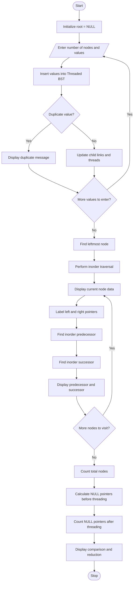

```mermaid
flowchart TD
    A([Start]) --> B[Initialize root = NULL]
    B --> C[/Enter number of nodes and values/]
    C --> D[Insert values into Threaded BST]
    D --> E{Duplicate value?}

    E -- Yes --> F[Display duplicate message]
    E -- No --> G[Update child links and threads]

    F --> H{More values to enter?}
    G --> H
    H -- Yes --> C
    H -- No --> I[Find leftmost node]

    I --> J[Perform inorder traversal]
    J --> K[Display current node data]
    K --> L[Label left and right pointers]
    L --> M[Find inorder predecessor]
    M --> N[Find inorder successor]
    N --> O[Display predecessor and successor]

    O --> P{More nodes to visit?}
    P -- Yes --> K
    P -- No --> Q[Count total nodes]

    Q --> R[Calculate NULL pointers before threading]
    R --> S[Count NULL pointers after threading]
    S --> T[Display comparison and reduction]
    T --> U([Stop])
```

