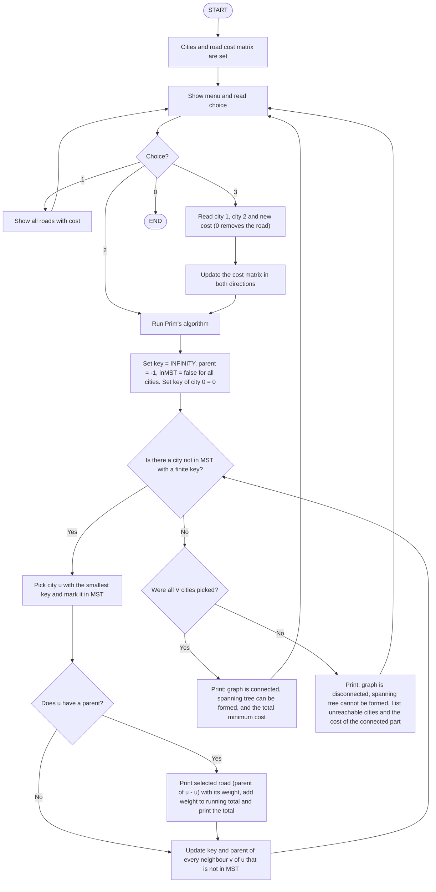

```mermaid
flowchart TD
    A([START]) --> B["Cities and road cost matrix are set"]
    B --> C["Show menu and read choice"]
    C --> D{"Choice?"}
    D -->|1| E["Show all roads with cost"]
    D -->|2| P["Run Prim's algorithm"]
    D -->|3| U["Read city 1, city 2 and new cost (0 removes the road)"]
    D -->|0| Z([END])
    E --> C
    U --> U2["Update the cost matrix in both directions"]
    U2 --> P

    P --> P1["Set key = INFINITY, parent = -1, inMST = false for all cities. Set key of city 0 = 0"]
    P1 --> P2{"Is there a city not in MST with a finite key?"}
    P2 -->|Yes| P3["Pick city u with the smallest key and mark it in MST"]
    P3 --> P4{"Does u have a parent?"}
    P4 -->|Yes| P5["Print selected road (parent of u - u) with its weight, add weight to running total and print the total"]
    P4 -->|No| P6["Update key and parent of every neighbour v of u that is not in MST"]
    P5 --> P6
    P6 --> P2
    P2 -->|No| P7{"Were all V cities picked?"}
    P7 -->|Yes| P8["Print: graph is connected, spanning tree can be formed, and the total minimum cost"]
    P7 -->|No| P9["Print: graph is disconnected, spanning tree cannot be formed. List unreachable cities and the cost of the connected part"]
    P8 --> C
    P9 --> C
```
