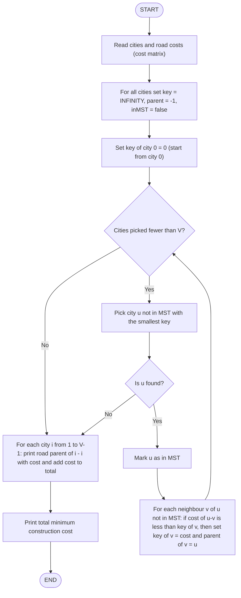

```mermaid
flowchart TD
    A([START]) --> B["Read cities and road costs (cost matrix)"]
    B --> C["For all cities set key = INFINITY, parent = -1, inMST = false"]
    C --> D["Set key of city 0 = 0 (start from city 0)"]
    D --> E{"Cities picked fewer than V?"}
    E -->|No| K["For each city i from 1 to V-1: print road parent of i - i with cost and add cost to total"]
    E -->|Yes| F["Pick city u not in MST with the smallest key"]
    F --> G{"Is u found?"}
    G -->|No| K
    G -->|Yes| H["Mark u as in MST"]
    H --> I["For each neighbour v of u not in MST: if cost of u-v is less than key of v, then set key of v = cost and parent of v = u"]
    I --> E
    K --> L["Print total minimum construction cost"]
    L --> M([END])
```
