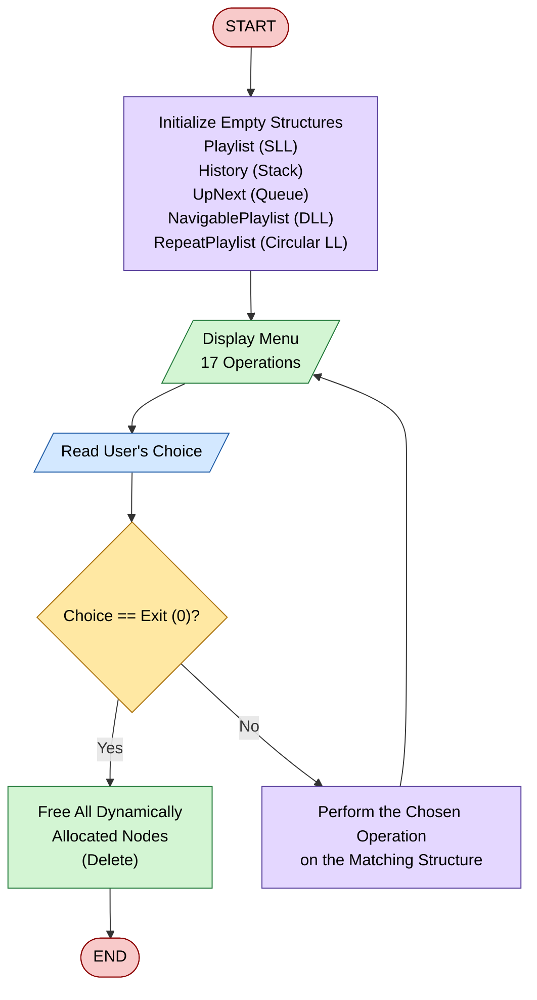

```mermaid
flowchart TD
    A([START]) --> B["Initialize Empty Structures<br/>Playlist (SLL)<br/>History (Stack)<br/>UpNext (Queue)<br/>NavigablePlaylist (DLL)<br/>RepeatPlaylist (Circular LL)"]

    B --> C[/Display Menu<br/>17 Operations/]
    C --> D[/Read User's Choice/]
    D --> E{"Choice == Exit (0)?"}

    E -- Yes --> F["Free All Dynamically<br/>Allocated Nodes<br/>(Delete)"]
    F --> G([END])

    E -- No --> H["Perform the Chosen Operation<br/>on the Matching Structure"]
    H --> C

    style A fill:#f8caca,stroke:#8b0000,color:#000
    style G fill:#f8caca,stroke:#8b0000,color:#000
    style B fill:#e4d7ff,stroke:#563d9b,color:#000
    style C fill:#d3f5d3,stroke:#237a3b,color:#000
    style D fill:#d3e8ff,stroke:#225ea8,color:#000
    style E fill:#ffe8a3,stroke:#ad7410,color:#000
    style F fill:#d3f5d3,stroke:#237a3b,color:#000
    style H fill:#e4d7ff,stroke:#563d9b,color:#000
```
