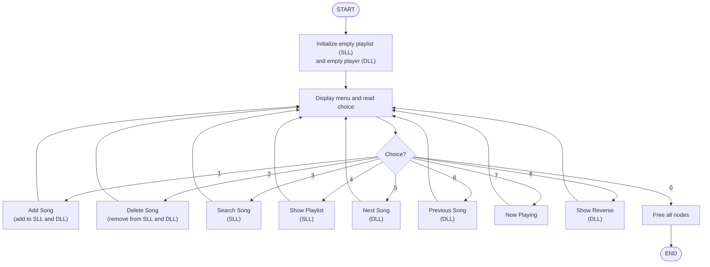

```mermaid
flowchart TD
    A([START]) --> B["Initialize empty playlist (SLL)<br/>and empty player (DLL)"]
    B --> C["Display menu and read choice"]
    C --> D{"Choice?"}
 
    D -->|1| E["Add Song<br/>(add to SLL and DLL)"]
    D -->|2| F["Delete Song<br/>(remove from SLL and DLL)"]
    D -->|3| G["Search Song<br/>(SLL)"]
    D -->|4| H["Show Playlist<br/>(SLL)"]
    D -->|5| I["Next Song<br/>(DLL)"]
    D -->|6| J["Previous Song<br/>(DLL)"]
    D -->|7| K["Now Playing"]
    D -->|8| L["Show Reverse<br/>(DLL)"]
    D -->|0| M["Free all nodes"]
 
    E --> C
    F --> C
    G --> C
    H --> C
    I --> C
    J --> C
    K --> C
    L --> C
    M --> N([END])
```
 
